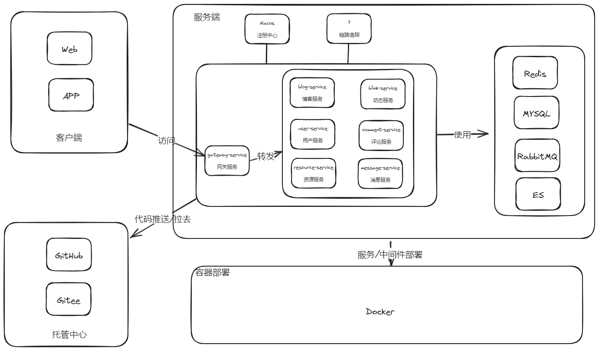

# BLOGC


BLOGC 是一个类似CSDN的微服务校园博客项目。主要服务有: 动态服务、资源服务、博客服务、网关服务、用户服务、消息服务、评论服务。

## 架构图


## 技术栈
```text
1、使用微服务架构设计，各服务之间通过 Fegin 进行调用通信，或者使用 RabbitMQ 进行消息通知。
2、利用 Nacos 作为注册中心，搭建配置服务。方便配置管理。
3、使用 GateWay 搭建网关服务，并配合 Redis 实现限流
4、使用 Minio 搭建对象存储服务，提升存储效率
5、使用 ES 作为搜索服务，提升用户搜索效率
6、使用 MySQL 作为数据存储
```
